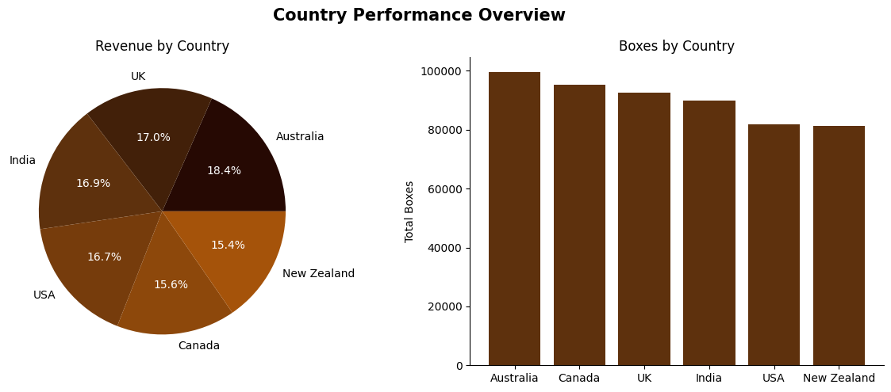
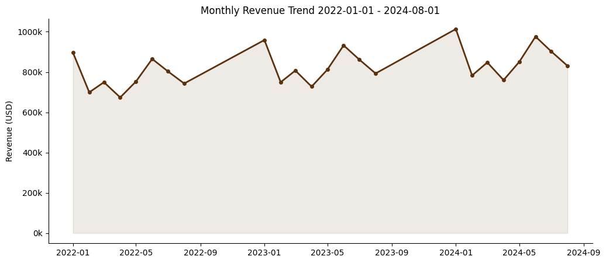

This repository is made to show my knowlege of data analysis.   
For now there is my training with dataset from Kaggle which I chose for this purpose [Chocolate sales](https://www.kaggle.com/datasets/saidaminsaidaxmadov/chocolate-sales)

- `chocolate_sales.ipynb` - data analysis with _pandas_, charts with _matplotlib_ and _seaborn_, and function for assigning abc groups

examples of charts:

- `chocolate_sales_sql.ipynb` - SQL queries with SQLite database

_to be continued..._